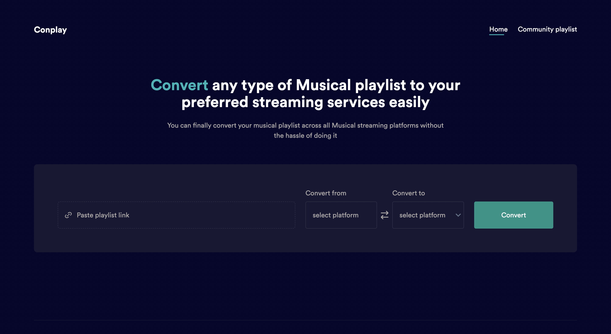

  <h2>
  A music app that allows porting music from one streaming platform to another. 

  </h2>

  <figure>
    
    <figcaption>
      

       Port playlist made easily from one music platform to another.
      

    </figcaption>
  </figure>

This is a lerna monorepo containing 2 packages; a frontend app and a backend app. We intend to expand it sometime in the future with other packages.

**Everything here is built from scratch while leveraging basic libraries like Express, ReactJs etc.**

To reach out to the developer: daveanifowoshe@gmail.com

See the documentation of each package to understand its underlining architecture, concepts and design ideologies.

## Contributing

See [CONTRIBUTING](CONTRIBUTING.md) for more information.
