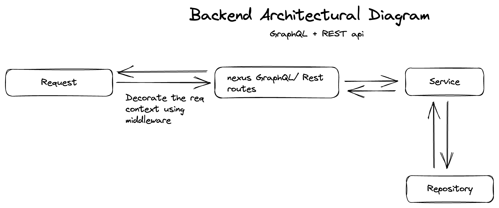

# Api

The api server is a GraphQL and REST server. We use [nexus](https://nexusjs.org/) for handling GraphQL. Also the framework that powers the api is built from scratch.

## Quick Start

To run the app, you need to run the following command:

1. Download docker [here](https://www.docker.com/products/docker-desktop/)
2. Start up the docker desktop
3. Run `git clone https://github.com/gbenga504/music-port.git`
4. Run `cd packages/api`
5. Run `docker-compose up` to start the dev server (You can attach the `-d` option to run in detached mode)

## Architecture

This image explains the architecture of the frontend app. It explains how various component play and work with each other

## Major technologies

- Typescript
- Express
- Nexus Js
