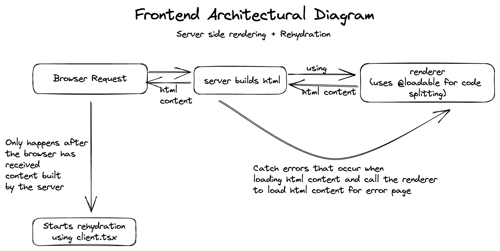

# Frontend app

The frontend app is a server rendered app with rehydration. It is built from scratch using

- ReactJs
- Express

## Quick Start

---

To run the app, you need to run the following command:

1. Run `git clone https://github.com/gbenga504/music-port.git`
2. Run `cd packages/frontend-app`
3. Run `yarn install`
4. Run `yarn dev` to start the dev server

PS: You also need to start the api server. Check the api [README](../api/README.md) on how this can be done.

## Architecture

---

This image explains the architecture of the frontend app. It explains how various component play and work with each other

## Major technologies

---

- Typescript
- ReactJs
- Express
- ReactRouter
- TailwindCSS
- Scss
- Babel (Build tool)
- Webpack (Build tool)
- Jest (Testing tool)
- Playwright (Testing tool)
